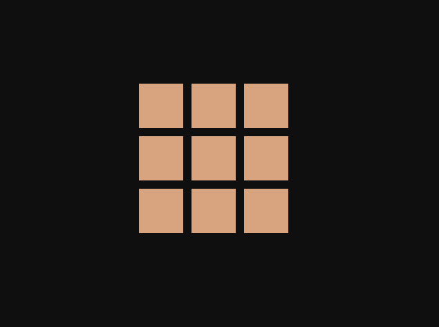
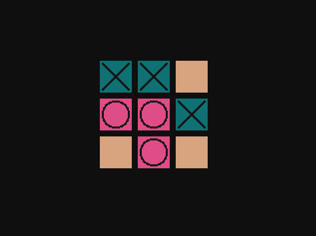
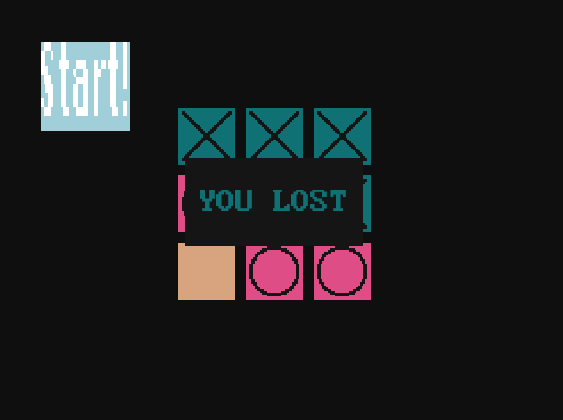

# A tic-tac-toe game

The game was written in C, using the SDL library.
The AI was implemented with the minimax algorithm; ergo, you can't win.

Click tiles to place marks.
Esc - brings up the start/restart button
There is no dedicated exit button, the only way to close the program is to press the 'x' in top right corner.

## Dependencies
- SDL
- SDL_image
- SDL_ttf
## Compilation
The paths to the libraries and sdl2-config need to be substituted.
```
default: main.c 
	gcc main.c -o build/main -Wall -Wextra -g3 `/usr/local/bin/sdl2-config --cflags --libs` -I path/to/sdl2_image/include -L path/to/sdl2_image/lib -lSDL2_image -I path/to/sdl2/include -L path/to/sdl2/lib -lSDL2_ttf -I path/to/sdl2_ttf/include -L path/to/sdl2_ttf/lib

main: main.o XOXO_Button.o
	gcc build/main.o build/XOXO_Button.o -o build/main -g3 `/usr/local/bin/sdl2-config --cflags --libs` -I path/to/sdl2_image/include  -L path/to/sdl2_image/lib -lSDL2_image -I path/to/sdl2/include -L path/to/sdl2/lib -lSDL2_ttf -I path/to/sdl2_ttf/include -L path/to/sdl2_ttf/lib

main.o: main.c
	gcc -Wall -Wextra -c main.c -o build/main.o -g3 `/usr/local/bin/sdl2-config --cflags --libs` -I path/to/sdl2_image/include -L path/to/sdl2_image/lib -lSDL2_image -I path/to/sdl2/include -L path/to/sdl2/lib -lSDL2_ttf -I path/to/sdl2_ttf/include -L path/to/sdl2_ttf/lib

XOXO_Button.o: XOXO_Button.c
	gcc -Wall -Wextra -c XOXO_Button.c -o build/XOXO_Button.o -g3 `/usr/local/bin/sdl2-config --cflags --libs` -I path/to/sdl2_image/include -L path/to/sdl2_image/lib -lSDL2_image -I path/to/sdl2/include -L path/to/sdl2/lib -lSDL2_ttf -I path/to/sdl2_ttf/include -L path/to/sdl2_ttf/lib
```

## Screenshots





